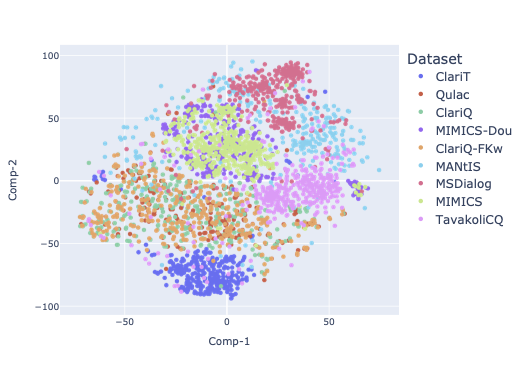

# ACQ Survey

An overview of the ACQ datasets.

## Abstract
The ability to understand a user’s underlying needs is critical for conversational systems, especially with limited input from users in a conversation. Thus, in such a domain, Asking Clarification Questions (ACQs) to reveal users’ true intent from their queries or utterances arise as an essential task. However, it is noticeable that a key limitation of the existing ACQs studies is their incomparability, from inconsistent use of data, distinct experimental setups and evaluation strategies. Therefore, in this paper, to assist the development of ACQs techniques, we comprehensively analyse the current ACQs research status, which offers a detailed comparison of publicly available datasets, and discusses the applied evaluation metrics, joined with benchmarks for multiple ACQs-related tasks. In particular, given a thorough analysis of the ACQs task, we discuss a number of corresponding research directions for the investigation of ACQs as well as the development of conversational systems.

## Datasets

### Conversational Search
| Year | Acronym | Authors | Title | Venue | Code | Dataset | Leaderboard |
|------|-------|------|------|------|-------|-------|-------|
| 2023 | ClariT | Yue et al. | [Towards asking clarification questions for information seeking on task-oriented dialogues](https://arxiv.org/abs/2305.13690)| Arxiv23 | [-](-) | [-](-) | [-]()
| 2019 | Qulac | Aliannejadi et al. | [Asking clarifying questions in open-domain information-seeking conversations](https://dl.acm.org/doi/abs/10.1145/3331184.3331265)| SIGIR19 | [-](-) | [-](-) | [-]()
| 2021 | ClariQ | Aliannejadi et al. | [Building and evaluating open-domain dialogue corpora with clarifying questions](https://aclanthology.org/2021.emnlp-main.367)| EMNLP21 | [-](-) | [-](-) | [-]()
| 2021 | TavakoliCQ | Tavakoli et al. | [Analyzing clarification in asynchronous information-seeking conversations](https://asistdl.onlinelibrary.wiley.com/doi/full/10.1002/asi.24562?casa_token=9VJi9ZHbwDYAAAAA%3AVgmUTd3TN7q9-YTvoXyTO4gb1KApVXdnUXU8_GpaFnNjINF-bXlJuV4KDIHXbv_PjqEOVv-MVddX5g)| JASISI21 | [-](-) | [-](-) | [-]()
| 2020 | MIMICS | Zamani et al. | [MIMICS: A Large-Scale Data Collection for Search Clarification](https://dl.acm.org/doi/abs/10.1145/3340531.3412772)| CIKM20 | [-](-) | [-](-) | [-]()
| 2019 | MANtIS | Penha et al. | [Introducing MANtIS: a novel Multi-Domain Information Seeking Dialogues Dataset](https://arxiv.org/abs/1912.04639)| Arxiv19 | [-](-) | [-](-) | [-]()
| 2021 | ClariQ-FKw | Sekulić et al. | [Towards facet-driven generation of clarifying questions for conversational search](https://dl.acm.org/doi/pdf/10.1145/3471158.3472257?casa_token=3Cuhuj31xP0AAAAA:DI8BDyMDvSDM4o-IACdLgHPltL2pNnRq2u0O0LbthY1HbC7r5fG5wg71sULxqbUvk5V0PO3fjFU)| ICTIR21 | [-](-) | [-](-) | [-]()
| 2018 | MSDialog | Qu et al. | [Analyzing and characterizing user intent in information-seeking conversations](https://dl.acm.org/doi/pdf/10.1145/3209978.3210124)| SIGIR18 | [-](-) | [-](-) | [-]()
| 2022 | MIMICS-Duo | Tavakoli et al. | [Mimics-duo: Offline & online evaluation of search clarification](https://dl.acm.org/doi/pdf/10.1145/3477495.3531750?casa_token=qdi5wVFWLncAAAAA:RcbL3JVfaF6SlJeN8ok_RbB_zS_0Igl5gcZf4VefVQj23ukeup3KjkcjDX64L-FG3CUrqCRN9Tc)| SIGIR22 | [-](-) | [-](-) | [-]()
|2022 |CAsT (Year 4)|Owoicho et al.|[TREC CAsT 2022: Going Beyond User Ask and System Retrieve with Initiative and Response Generation](https://trec.nist.gov/pubs/trec31/papers/Overview_cast.pdf)|TREC22|[-](-)|[-](-)|[-]()

### Conversational Question Answering
| Year | Acronym | Authors | Title | Venue | Code | Dataset | Leaderboard |
|------|-------|------|------|------|-------|-------|-------|
| 2020 | ClarQ | Kumar and Black | [Clarq: A large-scale and diverse dataset for clarification question generation](https://aclanthology.org/2020.acl-main.651)| ACL20 | [-](-) | [-](-) | [-]()
| 2018 | RaoCQ | Rao and Daumé III | [Learning to ask good questions: Ranking clarification questions using neural expected value of perfect information](https://aclanthology.org/P18-1255/)| ACL18 | [-](-) | [-](-) | [-]()
| 2019 | AmazonCQ | Rao and Daumé III | [Answer-based adversarial training for generating clarification questions](https://aclanthology.org/N19-1013.pdf)| ACL19 | [-](-) | [-](-) | [-]()
| 2019 | CLAQUA | Xu et al. | [Asking Clarification Questions in Knowledge-Based Question Answering](https://aclanthology.org/D19-1172/)| EMNLP-IJCNLP19 | [-](-) | [-](-) | [-]()

## Semantic Representation
We leverage the t-distributed Stochastic Neighbor Embedding (i.e., t-SNE) method to visualize the semantic representation of clarification questions (semantic embeddings) for comparing Conversational search and Conversational Question Answering datasets.

Conversational QA Datasets         |  Conversational Search Datasets
:-------------------------:|:-------------------------:
  |  

## Tasks

### T1: Clarification Need Prediction

### T2: Asking Clarification Questions (Ranking CQs)

The requirements:
```
!pip install --upgrade python-terrier
!pip install  --upgrade git+https://github.com/cmacdonald/pyterrier_bert.git
```

We preprocess each dataset into train/val/test sets with query-question pairs:

> ranking_approaches.py

### T3: User Satisfaction with CQs

## Details

Note that more details of experiments, datasets, and codes will be realased upon the acceptance of the paper. 

## Contributing

We welcome contributions to update this repository with growing development of asking clarification question datasets as well as relevant techniques. 

The contributions are suggested by following a common routine:
1. repository fork and clone.
2. add the updates and create pull requests (refer to [github help page](https://docs.github.com/en/pull-requests/collaborating-with-pull-requests/proposing-changes-to-your-work-with-pull-requests/creating-a-pull-request) to get the detailed instructions.).

We will regularly check the issues and pull requests for updating this repository.

## Citation
If you use our source code, dataset, and experiments for your research or development, please cite the following paper:

```
@inproceedings{rahmani2023acqsurvey,
  title={A Survey on Asking Clarification Questions Datasets in Conversational Systems},
  author={Hossein A. Rahmani, Xi Wang, Yue Feng, Qiang Zhang, Emine Yilmaz, Aldo Lipani},
  booktitle={The 61st Annual Meeting of the Association for Computational Linguistics, Toronto, Canada, July 9-14, 202},
  year={2023}
}
```
## TODO

- [ ] TREC CAst Dataset

## Contact
If you have any questions, do not hesitate to contact us by `hossein.rahmani.22@ucl.ac.uk` or `xi-wang@ucl.ac.uk`, we will be happy to assist.
