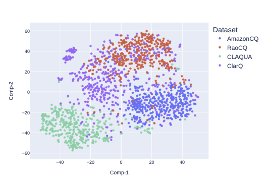

# ACQ Survey

An overview of the ACQ datasets.

## Abstract
The ability to understand a user’s underlying needs is critical for conversational systems, especially with limited input from users in a conversation. Thus, in such a domain, Asking Clarification Questions (ACQs) to reveal users’ true intent from their queries or utterances arise as an essential task. However, it is noticeable that a key limitation of the existing ACQs studies is their incomparability, from inconsistent use of data, distinct experimental setups and evaluation strategies. Therefore, in this paper, to assist the development of ACQs techniques, we comprehensively analyse the current ACQs research status, which offers a detailed comparison of publicly available datasets, and discusses the applied evaluation metrics, joined with benchmarks for multiple ACQs-related tasks. In particular, given a thorough analysis of the ACQs task, we discuss a number of corresponding research directions for the investigation of ACQs as well as the development of conversational systems.

## Datasets
dataset

## Semantic Representation
We leverage the t-distributed Stochastic Neighbor Embedding (i.e., t-SNE) method to visualize the semantic representation of clarification questions (semantic embeddings) for comparing Conversational search and Conversational Question Answering datasets.

Conversational QA Datasets         |  Conversational Search Datasets
:-------------------------:|:-------------------------:
  |  

## Tasks

### T1: Clarification Need Prediction

### T2: Asking Clarification Questions (Ranking CQs)

The requirements:
```
!pip install --upgrade python-terrier
!pip install  --upgrade git+https://github.com/cmacdonald/pyterrier_bert.git
```

We preprocess each dataset into train/val/test sets with query-question pairs:

> ranking_approaches.py

### T3: User Satisfaction with CQs

## Details

Note that more details of experiments, datasets, and codes will be realased upon the acceptance of the paper.


## Citation
If you use our source code, dataset, and experiments for your research or development, please cite the following paper:

```
@inproceedings{rahmani2023acqsurvey,
  title={A Survey on Asking Clarification Questions Datasets in Conversational Systems},
  author={Hossein A. Rahmani, Xi Wang, Yue Feng, Qiang Zhang, Emine Yilmaz, Aldo Lipani},
  booktitle={The 61st Annual Meeting of the Association for Computational Linguistics, Toronto, Canada, July 9-14, 202},
  year={2023}
}
```

## Contact
If you have any questions, do not hesitate to contact us by `hossein.rahmani.22@ucl.ac.uk` or `xi-wang@ucl.ac.uk`, we will be happy to assist.
